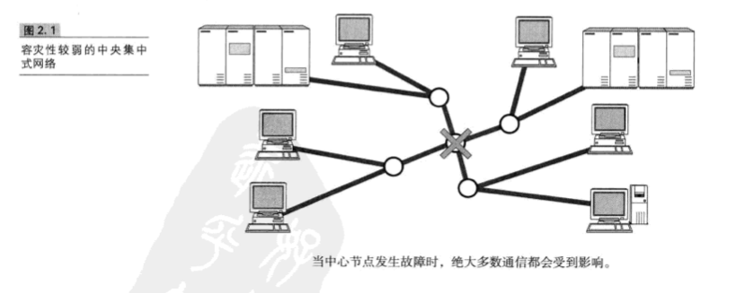
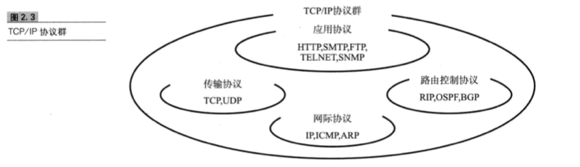
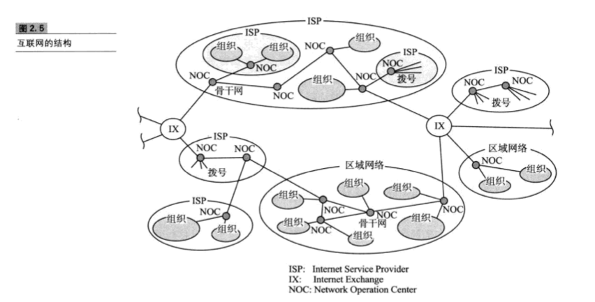
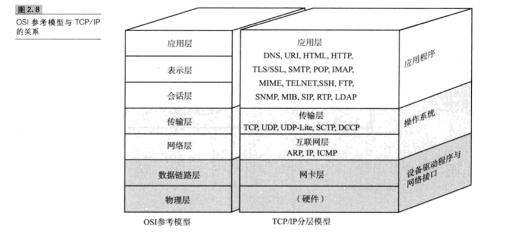
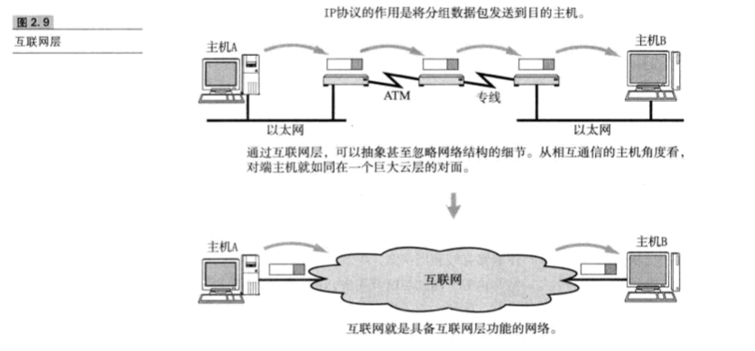
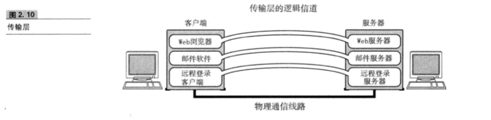
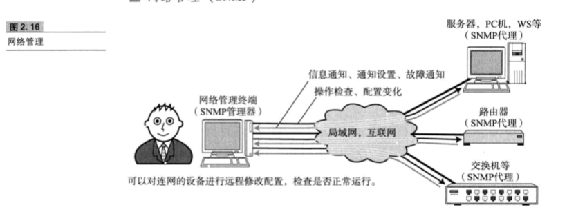
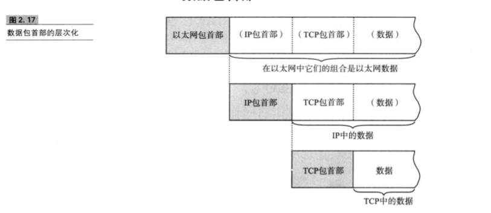
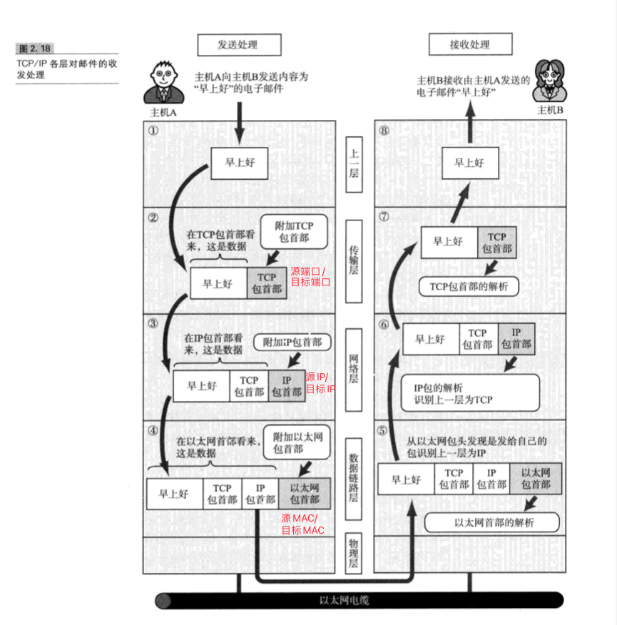
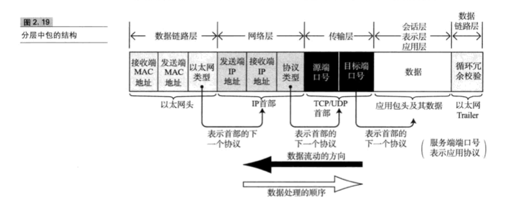

# 第2章 TCP/IP基础知识

## 2.1 TCP/IP出现的背景及其历史

### 2.1.1 从军用技术的应用谈起

分组交换技术:使多个用户同一时间共享一条通信线路进行通信,提高线路的使用效率,降低搭建线路成本的技术.

容灾性较强的分组网络

## 2.2 TCP/IP的标准化

### 2.2.1 TCP/IP的具体含义

TCP/IP:利用IP进行通信时,所必须用到的协议群的统称

### 2.2.2 TCP/IP标准化精髓

两大特点:

1. 具有开放性
2. 注重实用性

## 2.3 互联网基础知识

### 2.3.2 互联网与TCP/IP的关系

互联网的协议就是TCP/IP,TCP/IP就是互联网的协议.

### 2.3.3 互联网的结构

互联网中每个网络都是由骨干网(BackBone)和末端网(Stub)组成的.每个网络之间通过NOC(Network Operation Center,网络操作中心)构成.若网络的运营商不同,则网络连接方式和使用方法也不同.连接这种异构网络需要有IX(Internet Exchange,网络交换中心)的支持.可以认为互联网就是众多异构的网络通过IX互联的一个巨型网络.

## 2.4 TCP/IP协议分层模型

### 2.4.1 TCP/IP与OSI参考模型

OSI参考模型注重"通信协议必要的功能是什么",而TCP/IP协议更强调"在计算机上实现协议应该开发哪种程序"

### 2.4.2 硬件(物理层)

TCP/IP是在网络互连的设备之间能够通信的前提下才被提出的协议

### 2.4.4 互联网层(网络层)

IP协议基于IP地址转发分包数据

TCP/IP分层中的互联网层与传输层的功能通常由操作系统提供.尤其是路由器,它必须得实现通过互联网层转发分组数据包的功能.

##### IP

IP是跨越网络传送数据包,使整个互联网都能收到数据的协议.IP协议使数据能够发送到地球的另一端,这期间它使用IP地址作为主机的标识.

****
注:连接IP网络的所有设备必须有自己唯一的识别号以便识别具体的设备.分组数据在IP地址的基础上被发送到对端.
****

IP还隐含着数据链路层的功能.通过IP,相互通信的主机之间不论经过怎样的底层数据链路,都能够实现通信.

虽然IP也是分组交换的一种协议,但它不具有重发机制.即使是分组数据包未能到达对端主机也不会重发.因此数据非可靠性传输协议.

##### ICMP

IP数据包在发送图中一旦发生异常导致无法到达对端目标地址时,需要给发送端发送一个发生异常的通知.ICMP就是为了这一功能而制定的.它有时候也被用来诊断网络的健康情况.

##### ARP

从分组数据包的IP地址中解析出物理地址(MAC地址)的一种协议.

### 2.4.5 传输层

传输层最主要的功能就是能够让程序之间实现通信.

##### TCP

**TCP是一种面向有连接的传输层协议.**它可以保证两端通信主机之间的通信**可达**.TCP能够正确处理在传输过程中丢包、传输顺序乱掉等异常情况.

然而,为了建立与断开连接,有时候它需要至少7次的发包收包,导致网络流量的浪费.此外,为了提高网络的利用率,TCP协议中定义了各种复杂的规范,因此不利于视频会议(音频、视频的数据量既定)等场合使用.

##### UDP

UDP有别于TCP,**它是一种面向无连接的传输层协议.**UDP不会关注对端是否真的收到了传送过去的数据,如果需要监察队短是否收到分组数据包,或者对端是否连接到网络,则需要在应用程序中实现.

UDP常用于分组数据较少或多播、广播通信以及视频通信等多媒体领域.

### 2.4.6 应用层(会话层以上的分层)

##### WWW

WWW中的HTTP属于OSI应用层的协议,而HTML属于表示层的协议.

##### 电子邮件(E-Mail)

MIME属于OSI参考模型的第6层:表示层.

##### 文件传输(FTP)

在FTP中进行文件传输时,会建立2个TCP连接,分别是发出传输请求时所要用到的控制连接与实际传输数据时所要用到的数据连接.

****
注:这两种连接的控制管理属于会话层的功能.
****

##### 网络管理(SNMP)

使用SNMP管理的主机、网桥、路由器等称作SNMP代理(Agent),而进行管理的那一端叫做管理器(Manager).

## 2.5 TCP/IP分层模型与通信示例

### 2.5.1 数据包首部

每个分层中,都会对所发送的数据附加一个首部,在这个首部中包含该层必要的信息,比如发送的目标地址以及协议的相关信息.

****

包、帧、数据报、段、消息

以上五个术语都用来表示数据的单位,大致区分如下:

包可以说是全能性术语.帧用于表示数据链路层中包的单位.而数据报是IP和UDP等网络层以上的分层中包的单位.段则表示TCP数据流中的信息.消息是指应用协议中数据的单位.

****

### 2.5.2 发送数据包

##### ① 应用程序处理

首先,应用程序中会进行编码处理.比如UTF-8,GB2312等编码.这些编码相当于OSI的表示层功能.

##### ② TCP模块的处理

TCP首部中包括源端口号和目标端口号(用以识别发送主机跟接收主机上的应用)、序号(用以表示该包中数据是发送端整个数据中第几字节的序列号)以及校验和(Check Sum.用来检验数据的读取是否正常进行的方法).

##### ③ IP模块的处理

在TCP首部的前端加上自己的IP首部.IP首部中包含接收端IP地址以及发送端IP地址.紧随IP首部的还有用来判断其后边的数据是TCP还是UDP的信息.

IP包生成后,参考路由控制表决定接受此IP包的路由或主机.随后,IP包将被发送给链接这些路由器或主机网络接口的驱动程序,以实现真正发送数据.

##### ④ 网络接口(以太网驱动)的处理

以太网首部中包含接收端MAC地址、发送端MAC地址以及标志以太网类型的以太网数据的协议.根据上述信息产生的以太网数据包将通过物理层传输给接收端.发送处理中的FCS(Frame Check Sequence)由硬件计算,添加到包的最后.设置FCS的目的是为了判断数据包是否由于噪声而被破坏.

### 2.5.3 经过数据链路的包

每个分层的包首部中还包含一个识别位,它时用来标识上一层协议的种类信息.

### 2.5.4 数据包接收处理

**包的接收流程是发送流程的逆序过程.**

##### ⑤ 网络接口(以太网驱动)的处理

首先从以太网的包首部找到MAC地址并判断是否为发给自己的包,如果不是则丢弃数据.

****
很多NIC(Network Interface Card,网络接口卡,即网卡)产品可以设置为即使不是发给自己的包也不丢弃数据.这可以用于监控网络流量.
****

如果是发给自己的包,就查找以太网包首部中的类型域从而确定以太网协议所传送过来的数据类型.本例中数据类型为IP包,因此再将数据传给处理IP的子程序.若以太网包首部的类型域包含了一个无法识别的协议类型,则丢弃数据.

##### ⑥ IP模块的处理

对于有路由器的情况下,接收端地址往往不是自己的地址,此时,需要借助路由控制表,在调查应该送达的主机或路由器以后再转发数据.

##### ⑦ TCP模块的处理

在TCP模块中,首先会计算一下校验和,判断数据是否被破坏,然后检查是否在按照序号接收数据.最后检查端口号,确定具体的应用程序.

数据接收完毕后,接收端则发送一个"确认回执"给发送端.如果这个回执信息未能达到发送端,那么发送端会认为接收端没有接收到数据而一直反复发送.

数据被完整地接收后,会传给由端口号识别的应用程序

##### ⑧ 应用程序的处理

