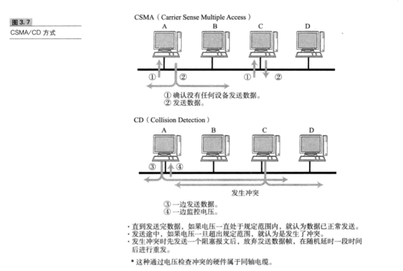

# 第3章 数据链路

## 3.1 数据链路的作用

数据链路,指OSI参考模型中的数据链路层,有时也指以太网、无线局域网等通信手段.

TCP/IP中对于OSI参考模型的数据链路层及以下部分(物理层)未做定义.因为TCP/IP以这两层的功能是透明的为前提.

数据链路层的协议定义了通过通信媒介互联的设备之间传输的规范.

数据链路层处理的数据也不是单纯的0/1序列,该层把它们集合为一个叫做"帧"的块,然后再进行传输.

数据链路也可以被视为网络传输中的最小单位.

****

##### 数据链路的段

数据链路的段是指一个被分割的网络.根据使用者的不同,其含义也不同.例如:引入中继器将两条网线项链组成一个网络.

从网络层的概念看,这个由中继器连接起来的通路是一个网络.即:从网络层的立场出发,这两条网线组成了一个段.

从物理层的概念看,两条网线分别是两个物体.即:从物理层的观点出发.一条网线是一个段.
****

****

##### 网络拓扑

网络的连接和构成的形态称为网络拓扑(Topology).拓扑一词不仅用于直观可见的配线方式上,也用于逻辑上网络的组成结构.

****

## 3.2 数据链路相关技术

### 3.2.1 MAC地址

MAC地址用于识别数据链路中互连的节点.

MAC地址长48bits.在使用网卡(NIC)的情况下,MAC地址一般会被烧入到ROM中.因此,任何一个网卡的MAC地址都是唯一的,在全世界范围内都不会有重复.(也有例外,后续有注解)

第1位:单播地址(0)/多播地址(1)

第2位:全局地址(0)/本地地址(1)

第3-24位:由IEEE管理并保证各厂家之间不重复

第25-48位:由厂商管理并保证产品之间不重复

MAC地址一般用16进制数表示.

本图表示了一个16进制多播MAC地址.即MAC地址为:01:00:XX:XX:XX:XX

注意比特流的传输顺序和16进制数的表示顺序相反.

****

##### 例外情况--MAC地址不一定是唯一的

MAC地址在全世界范围内也并不总是唯一的.实际上,即使MAC地址相同,只要不是同属于一个数据链路就不会出现问题.

例如,人们可以在微机板上自由设置自己的MAC地址;再例如,一台主机上如果启动多个虚拟机,由于没有硬件的网卡,只能由虚拟软件自己设定MAC地址给多个虚拟网卡,此时就很难保证所生成的MAC地址是独一无二的了.

****

### 3.2.2 共享介质型网络

从通信介质(通信,介质)的使用方法上看,网络可分为共享介质型和非共享介质型.

共享介质型网络:由多个设备共享一个通信介质的一种网络.

共享介质型网络中有两种介质访问控制方式:争用方式和令牌传递方式.

##### 争用方式

争用方式(Contention):指争夺获取数据传输的权力,也叫CSMA(载波监听多路访问).这种方法通常领网络中的各个站(数据链路中很多情况下称节点为"站")采用先到先得的方式占用信道发送数据,如果多个站同时发送帧,则会产生冲突现象.因此会导致网络拥堵与性能下降.

改良CSMA的另一种方式--CSMA/CD(Carrier Sense Multiple Access with Collision Detection).

CSMA/CD要求每个站提前检查冲突,一旦发生冲突,则尽早释放信道.具体工作原理如下:

- 若载波信道上没有数据流动,则任何站都可以发送数据.
- 检查是否会发生冲突.一旦发生冲突时,放弃发送数据(注:实际上会发送一个32bits特别的信号,在阻塞报文以后再停止发送.接收端通过发生冲突时帧的FCS,判断出该帧不正确从而丢弃该帧),同时立即释放载波信道.
- 放弃发送以后,随机延时一段时间,再重新争用介质,重新发送帧.

1. 确认没有任何设备发送数据
2. 发送数据
3. 一边发送数据
4. 一边监控电压

- 直到发送完数据,如果电压一直处于规定范围内,就认为数据已正常发送.
- 发送途中,若电压一旦超出规定范围.就认为是发生了冲突
- 发生冲突时,先发送一个阻塞报文后,放弃发送数据帧,在随机延时一段时间后,进行重发.

**这种通过电压检查冲突的硬件属于同轴电缆.**

##### 令牌传递方式

令牌传递方式是沿着令牌环发送一种叫做"令牌"的特殊保温,是控制传输的一种方式.只有获得令牌的站才能发送数据.

这种方式有2个特点:

1. 不会有冲突
2. 每个站都有通过平等循环获得令牌的机会

因此,即使网络拥堵也不会导致性能下降.

当然,这种方式中,一个站在没有收到令牌前不能发送数据帧,因此在网络不太拥堵的情况下,数据链路的利用率也就达不到100%.

step1. D站将令牌发送给A站,A站获得令牌后才可以发送数据.

step2. A站发送一个目标地址为C站,源地址为A站的数据.数据包经B站发送给C站.经过B站时,B站发现不是发给自己的包,则原封不动地沿着环转发给下一个站.

step3. C站收到数据包后,发现是发给自己的数据包,则设置一个"已接收数据"的标志位在该数据包内,沿着环再发送给下一个站(也就是D站).

step4. A站收到来自D站的数据包后,数据帧由于回到发送源地址后被丢弃,而令牌则沿着环,传递给下一个站.

**在这个过程中可以看到,令牌要等到发送方确认对端接收到数据帧后,才会传递给下一个站.**

为此,衍生了多种令牌传递的技术.比如,早期令牌释放、令牌追加(注:不等待接收方数据到达确认就将令牌发送给下一个站)等方式以及多个令牌同时循环等方式.这些方式的目的都是为了尽可能地提高网络性能.

### 3.2.3 非共享介质网络

非共享介质网络:指不共享介质,对介质采取专用的一种传输控制方式.在这种方式下,网络中的每个站直连交换机,由交换机负责转发数据帧.此方式下,发送端与接收端不共享通信介质,因此很多情况下采用全双工通信方式.

****

##### 半双工与全双工通信

半双工:只发送或只接收的通信方式.也就是说,一端在发送时,对端不能发送只能接收.不能同时发送.

全双工:允许双端在同一时刻既发送数据又接收数据.

****

### 3.2.4 根据MAC地址转发

****

##### 交换机转发方式

交换机转发方式有2种:存储转发和直通转发

存储转发方式检查以太网数据帧末尾的FCS(Frame Check Sequence)位后再进行转发.因此,可以避免发送由于冲突而被破坏的帧或噪声导致的错误帧.

直通转发方式中不需要将整个帧全部接收下来以后再进行转发.只需要得知目标地址即可开始转发.因此它具有延迟较短的优势.但同时不可避免地有发送错误帧的可能性.

****

### 3.2.5 环路检测技术

最坏情况洗啊,数据帧会在环路中被一而再再而三地持续转发.而一旦这种数据帧越积越多,将会导致网络瘫痪.

****

注:网络瘫痪是指由于异常的数据帧遍布网络,造成无法正常通信的状态.很多情况下只有关掉网络设备的电源或断开网络才能恢复.

****

##### 生成树方式

该方法要求每个网桥必须在每1-10秒内相互交换BPDU(Bridge Protocol Data Unit)包,从而判断哪些端口使用哪些端口不使用,以便消除环路.而一旦发生故障,则自动切换通信线路,利用哪些没有被使用的端口继续进行传输.

##### 源路由法

该方法用来解决令牌环(Token Ring)网络的问题.该方法可以判断发送数据的源地址是通过哪个网桥实现传输的,并将帧写入RIF(Routing Information Field).网桥则根据这个RIF信息发送帧给目标地址.因此,即使网桥中出现了环路,数据帧也不会被反复转发,可成功地发送到目标地址.在这种机制中,发送端本身必须具备源路由功能.

### 3.2.6 VLAN

交换机按照端口区分多个网段,从而区分了广播数据的范围、减少了网络负载并提高了网络的安全性.

## 3.3 以太网

### 3.3.1 以太网连接形式

在以太网普及之初,一般采用多台终端使用同一根同轴电缆的共享介质型连接方式.

而现在,随着互联设备的处理能力以及传输速率的提高,一般都采用终端与交换机之间独占电缆的方式实现以太网通信.

### 3.3.2 以太网的分类

****

##### 传输速度与计算机内部的表现值

计算机内部采用2进制,因此以2^10表示最接近于1000的值.于是有:

1KB = 1024Bytes

1MB = 1024KB

1GB = 1024MB

而以太网中以时钟频率决定传输速度,于是有:

1Kbps = 1000bps

1Mbps = 1000Kbps

1Gbps = 1000Mbps

****

### 3.3.3 以太网的历史

起初以太网的访问控制一般以半双工通信为前提采用CSMA/CD方式.

随着ATM交换技术(将固定长度的信元通过交换机快速传送)和CAT5 UDP电缆的普及,以太网的结构也发生了变化.主键采用像非共享介质网络那样直接与交换机连接的方式.

### 3.3.4 以太网帧格式

每个以太网帧发送时都是以8个字节的前导码开始,Preamble是1和0的交替(即:1 0 1 0 1 0 ....)的7个字节数据,该部分的作用时通知接收方有数据帧到来,使接收方与输入的时钟保持同步,56bits(即7字节)模式容许站点在帧的开始可以丢弃一些bit.

SFD(Start Frame Delimiter)是一个字节,内容为1 0 1 0 1 0 1 1.最后使用11结尾,来通知接收方下一字段就是目的主机的地址了.实际上前导码和SFD都是在物理层加进去的,并不是帧的一部分.

以太网中将最后2bits成为SDF,而IEEE802.3中将最后8bits称为SDF.但内容都是一样的.

DA(Destination Address):6字节,目的节点的MAC地址

SA(Source Address):6字节,源节点的MAC地址

Type/Length:2字节.根据数值的不同代表2种不同的封装格式.若字段值在0x0000-0x05DC范围内,则表示该字段为Length,该帧为802.3 raw封装.若该字段值在0x0600-0xFFFF范围内,则表示该字段为Type字段,该帧为Ethernet II封装.0x05DD－0x05FF保留没有使用.

PayLoad:上层协议有效载荷.最小为46字节,最大为1500字节.对于Type封装格式,上层协议必须保证该字段的值大于46字节;对于Length封装格式,对于有效载荷不够46字节的报文,链路层必须进行补充.

FCS:Frame Check Sequence,帧检验序列,4字节的校验和.

类型编号(16进制)及其对应协议的作用

[以太网基础知识](https://blog.csdn.net/sun172270102/article/details/61925871)

****

##### FCS计算方式

FSC中保存着整个帧除以生成多项式的余数的反码.在接收端也采用同样的方式计算,若得到的FCS值相同,就判定所接收的帧是完整的.

##### 1. CRC校验原理

大体做法:先在要发送的帧后边附加一个数(这个数就是用来校验的校验码,此处所说的数使用二进制序列表示的,以下皆同),生成一个新的帧发送给接收端.这个附加的数不是随意的,生成的帧必须满足条件:能够被发送端和接收端共同选定的某个特定的数整除(模2除法).

数据帧被发送到接收端后,接收端把这个帧除以这个选定的除数.由于发送端在发送数据帧之前已经通过附加一个数,达到了"去余"的效果,即已经能够被整除的.所以结果应该是没有余数的.如果有余数,则说明该帧在传输过程中出现了差错.

##### 2. 模2除法

模2除法与算术除法类似,但它既不向上位借位,也不比较除数和被除数的相同位数值的大小,只以相同位数进行相除即可.

模2加法运算的规则:

1 + 1 = 10

0 + 1 = 1

0 + 0 = 0

无进位,无借位

模2减法运算的规则:

1 - 1 = 0

0 - 1 = 1

1 - 0 = 1

0 - 0 = 0

无进位,无借位

可以看到,模2加法和模2减法就相当于二进制中的逻辑异或运算.即:**若2个操作数相同,则比较后结果为0;否则比较后结果为1.**

以 100101 除以 1110 为例:

##### 3. CRC校验原理的具体操作

step1. 先选择(可以随机选择,也可以按标准选择,具体做法看后文)一个用于在接收端进行校验时,对接收的帧进行模2除法运算的除数.这个除数是二进制比特串,通常以多项式方式表示,所以CRC又称多项式编码方法,这个多项式也称为"生成多项式",这个除数称为生成多项式值.

step2. 设所选定的除数为k位,要发送的数据帧为m位.在数据帧后边加上k-1位的0,即新生成的帧为m + k - 1位.使用这个新生成的和step1中选定的除数做模2除法,所得到的余数的反码即为该帧的CRC校验码,也叫FCS(帧校验序列).需要注意的是:**余数的位数只能比除数的位数少1位.即使前面的位是0,甚至余数全为0(即整除了),也都不能省略.**

step3. 再把这个校验码附加在原数据帧(即m位的原始帧)后面,构建另一个新的帧.将这个新生成的帧发送到接收端,最后在接收端把这个新的帧以模2除法的方式除以step1中选定的除数,若没有余数,则表明该帧在传输过程中没有出错,否则即出现了错误.

##### 4. 生成多项式的选取方法

CRC校验中有2个关键点:

1. 预先确定一个发送端和接收端都用来作为除数的二进制比特串
2. 把原始帧与选定的除数进行模2除法,计算FCS

其中,这个作为除数的二进制比特串可以随机选择,也可以按照国际上同行的标准选择.

对除数的二进制比特串的要求:

1. 最高位和最低位必须同时为1
2. 当被发送数据帧中的任何一位发生错误时,被生成多项式做模2除法后,应使余数不为0
3. 不同的位发生错误时,应使得余数不同
4. 对余数继续做模2除法,应该使余数循环.

由此可见,CRC生成多项式的功能有2点:

1. 接收方检测数据帧是否正确
2. 若数据帧不正确,则可以通过模2除法所得到的余数,确定异常的位置

具体的生成方法为:对给定的一个多项式,设n为多项式中x的最高次幂,则有:生成多项式的长度为n + 1位.在多项式中,若

存在,则对应的二进制比特串中,从右向左数第 k + 1 位为1;若

不存在,则对应的二进制比特串中,从右向左数第 k + 1 位为0;

例:现有生成多项式如下:

=x^4+x^3.jpeg)

则其对应的生成多项式值为:1101

##### 5. 基于CRC4的一个实例

设:此时要发送一个16位的消息:1001 1110 0010 1111

CRC4的生成多项式值为:10011

计算发送时的FCS值.

则此时FCS的值为:1110(余数的反码)

****

****

##### 数据链路层分为两层

再进一步细分,数据链路层分为介质访问控制层(MAC:Media Access Control)和逻辑链路控制层(LLC:Logical Link Control)

介质访问控制层根据以太网或FDDI等不同数据链路所特有的首部信息进行控制.逻辑链路控制层则根据以太网或FDDI等不同数据链路所共有的帧头信息进行控制.

IEEE802.3 Ethernet的帧格式中中附加的LLC和SNAP就是由逻辑链路控制的首部信息.从上文中的类型编号及其对应协议的作用图中可以看出,当类型字段的值为00000 - 01500(即16进制的0000 - 05DC)时,表示IEEE802.3 Ethernet的长度.此时,即使参考类型对照表也无法确定上层协议的类型(因为此时该字段的值表示的含义为帧长度,而非像以太网帧体格式那样,表示上层协议的类型).在IEEE802.3 Ethernet中,紧随长度字段后边的LLC和SNAP字段中,包含了上层协议的类型信息.因此只有查找到SNAP后,才能继而判断上层协议的类型.

注意:图中的AA/03等,表示该字段的值是写死的0xAA和0x03.

****

## 3.4 无线通信

### 3.4.1 无线通信的种类

PAN:Personal Area Network

LAN:Local Area Network

MAN:Metropolitan(adj. 大都市的 n. 大城市人) Area Network

WAN:Wide Area Network

### 3.4.2 IEEE802.11

IEEE802.11定义了无线LAN协议中物理层与数据链路层的一部分(MAC层)

## 3.5 PPP

### 3.5.1 PPP定义

PPP:Point-to-Point Protocol.指点对点,即1对1连接计算机的协议.PPP相当于位于OSI参考模型第2层的数据链路层.

PPP属于纯粹的数据链路层,与物理层没有任何关系.换言之,仅有PPP无法实现通信,还需要有物理层的支持.

PPPoE:PPP over Ethernet.是在以太网数据中加入PPP帧进行传输的一种方式.

### 3.5.2 LCP与NCP

在开始传输数据前,要先建立一个PPP级的连接.

在PPP的主要功能中,包括2个协议:一个是不依赖上层的LCP协议(Link Control Protocol),另一个是依赖上层的NCP协议(Network Control Protocol).若上层为IP,则此时NCP也叫做IPCP(IP Control Protocol).

LCP主要负责建立和断开连接,设置最大接收单元(MRU,Maximum Receive Unit),设置验证协议(PAP或CHAP),以及设置是否进行通信质量的监控.

IPCP负责IP地址设置以及是否进行TCP/IP首部压缩等设备(注:设备之间的这种交互也叫协商,Negotiation).

通过PPP连接时,通常需要记性用户名密码的验证,并且对通信两端进行双方向的验证.其验证协议有2种:PAP(Password Authentication Protocol)和CHAP(Challenge Handshake(n. 握手) Authentication Protocol)

PAP是PPP连接建立时,通过2次握手进行用户名和密码验证.其中密码以明文方式传输.因此一般用于安全要求不是很高的环境.

CHAP则使用一次性密码OTP(One Time Password),可以有效防止窃听.

### 3.5.3 PPP的帧格式

PPP的数据帧中,标志码用来区分每个帧.这一点和HDLC(High Level Data Link Control Procedure(n. 程序)高级数据链路控制)协议十分相似.因为PPP本身就是基于HDLC制定出来的一种协议.

HDLC就是在每个帧前后加上一个8位字节"01111110"用来区分帧.这1个8位字节叫做标志码.在2个标志码中间,不允许出现连续6个以上的1.因此,在发送帧的时候,当出现连续的5个"1"时,后面必须插入一个0.当接收端在接收帧时,如果收到连续的5个"1"且后边跟着的是0,就必须删除.由于最多只会出现5个连续的1,就可以比较容易地通过标志码来区分帧的起始与终止.PPP的标准帧格式和HDLC完全相同.

另外,在通过电脑进行拨号时,PPP已经在软件中实现.因此,那些插入或删除"0"的操作或FCS计算都交由电脑的CPU去处理.这也是为什么人们常说PPP这种方式会给计算机带来大量负荷的原因所在.

### 3.5.4 PPPoE

## 3.6 其他数据链路

### 3.6.1 ATM

ATM(Asynchronous Transfer Mode)是以一个叫做信元(5字节首部加48字节数据)的单位进行传输的数据链路.

##### ATM的特点

ATM与传统电话不同,允许同时与多个对端建立通信连接.

ATM中没有类似以太网和FDDI那种发送权限的限制.它允许在任何时候发送任何数据.因此,当大量计算机同时发送大量数据时,容易引发网络拥堵甚至使网络进入收敛状态(收敛状态指当网络非常拥堵时,路由器或交换机无法完成包的处理,从而丢弃这些包的一种状态).为了防止这种现象的出现,ATM中也增加了限制带宽的细分功能.

##### ATM与上层协议

在以太网中一个帧最大可传输1500个字节,FDDI可以最大传输4352个字节.而ATM的一个信元只能固定发送48字节的数据.这48字节的数据部分中若包含IP首部和TCP首部,则基本无法存放上层的数据.因此,一般不会单独使用ATM,而是使用上层的AAL(ATM Adapter Layer,从ATM的角度上是上一层,对IP层来说是下一层).在上层为IP的情况下,则叫做AAL5.如下图示,每个IP包被附加各层的协议首部后,最多可以被分成192个信元发送出去.

从这个图中可以看出,在整个192个信元中,只要有1个丢失,那么整个IP包就相当于被损坏.此时,AAL5的帧检查位报错,导致接收端不得不丢弃所有的信元.前面曾提到TCP/IP在包发生异常的时候可以实现重发,因此在ATM网中,即使只有1个信元丢失,也要重新发送最多192个信元.这也是ATM到目前为止的最大弊端.

### 3.6.3 FDDI

FDDI(Fiber(n. 纤维) Distributed Data Interface),叫做分布式光纤数据接口.

FDDI采用令牌(追加令牌)环的访问方式.令牌环访问方式在网络拥堵的情况下极易导致网络收敛.

