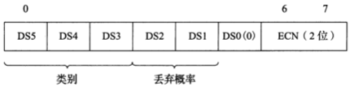
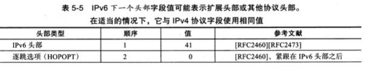
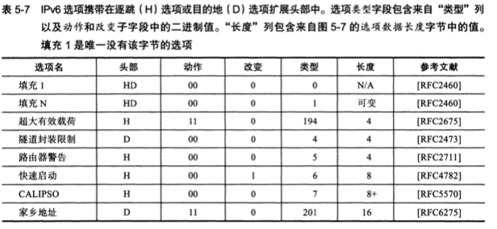

#  第4章 IP协议

## 4.1 IP即网际协议

这一层主要由IP(Internet Protocol)和ICMP(Internet Control Message Protocol)两个协议组成.本章仅对IP协议进行详细说明.

### 4.1.1 IP相当于OSI参考模型的第3层

IP(IPv4、IPv6)相当于OSI参考模型中的第3层--网络层.

网络层的主要作用是"实现终端节点之间的通信".这种终端节点之间的通信也叫"点对点(end-to-end)通信".

网络层的下一层--数据链路层的主要作用是在两个联通在同一种数据链路的节点之间进行包传递.而一旦跨越多种数据链路,就需要借助网络层.网络层可以跨越不同的数据链路,即使在不同的数据链路上也能实现两端节点之间的数据包传输.


****

##### 主机与节点

普适的讲,配有IP地址的设备叫做主机.

但准确的说,主机的定义应该是"配置有IP地址,但是不进行路由控制"的设备.

既配有IP地址又具有路由控制能力的设备叫做路由器,跟主机有所区别.

而节点则是主机和路由器的统称.

****

### 4.1.2 网络层与数据链路层的关系

数据链路层对两个直连的设备提供通信功能.与之相比,作为网络层的IP则负责在没有直连的两个网络之间进行传输.


## 4.2 IP基础知识

IP大致分为3大作用模块:IP寻址、路由(最终节点为止的转发)、IP分包与组包

### 4.2.1 IP地址属于网络层地址

MAC地址是用来标识同一个链路中不同计算机的一种识别码.

IP地址用于在"连接到网络中的所有主机中,识别出进行通信的目标地址".因此,在TCP/IP通信中,所有主机或路由器必须设定自己的IP地址(严格来说,要针对每块网卡至少配置1个或1个以上的IP地址).


不论一台主机与那种数据链路连接,其IP地址的形式都保持不变.以太网、无线局域网、PP等,都不会改变IP地址的形式(实际上数据里哪路的MAC地址的形式不一定必须一致).网络层对数据链路层的某些特性进行了抽象.数据链路的类型对IP地址形式透明,这本身就是其中抽象化的一点.

### 4.2.2 路由控制

路由控制(Routing)是指将分组数据发送到最终目标地址的功能.即使网络非常复杂,也可以通过路由控制确定到达目标地址的通路.一旦这个路由控制的运行出现了异常,分组数据极有可能"迷失",无法到达目标地址.因此,一个数据包之所以能够成功地到达最终的目标地址,全靠路由控制.


****

##### 发送数据至最终目标地址

Hop中文译作"跳".它是指网络中的一个区间.IP包正是在网络中的一个跳间被转发.因此IP路由也叫做多跳路由.在每一个区间内,决定着包在下一跳被转发的路径.


##### 一跳的范围

一跳(1 Hop)是指利用数据链路层以下分层的功能,传输数据帧的一个区间.

以太网等数据链路中,使用MAC地址传输数据帧.此时的一跳是指从源MAC地址到目标MAC地址之间传输帧的区间.

****

多跳路由是指路由器或主机在转发IP数据包时,只指定下一个路由器或主机,而不是将到最终目标地址为止的所有通路全部指定出来.因为每一个区间(跳)在转发IP数据包时,会分别指定下一跳的操作,直至包达到最终的目标地址.


****

包每到达一个路由器再和路由器进行交互,问询下一跳地址,最终到达目标地址的方式,是一种及其偶然的方式.英文叫做"Ad Hoc",是指具有偶然性的、在各跳之间无计划传输的意思.尤其在谈到IP时,会经常用到该词.

****

IP数据包的传输和这个例子道理是相同的.当某个IP包到达路由器时,路由器先查找其目标IP地址,从而再决定下一步应该将这个包发往哪个路由器,然后将包发送过去(IP包被转发到途中的某个路由器时,实际上是装入数据链路层的数据帧以后再被送出.以以太网为例,目标MAC地址就是下一个路由器的MAC地址.).当这个IP包到达下一个路由器后,会再次经历查找下一个目标地址的过程,并由该路由器转发给下一个被找到的路由器.这个过程可能会反复多次,直到找到最终的目标地址,将数据包发送给这个节点.


****

##### 路由控制表

为了将数据包发给目标主机,所有主机都维护着一张路由控制表(Routing Table).该表记录IP数据在下一步应该发给哪个路由器.IP包将根据这个路由表,在各个数据链路上传输.


****

### 4.2.3 数据链路的抽象化

IP是实现多个数据链路之间通信的协议.数据链路根据种类的不同各有特点.对这些不同数据链路的相异特性进行抽象化,也是IP的重要作用之一.

不同数据链路有个最大的区别,就是他们各自的最大传输单位(MTU,Maximum Transmission Unit)不同.


MTU的值在以太网中是1500bytes,在FDDI中是4352bytes,而ATM则为9180bytes.IP的上一层可能会要求传送比这些MTU更多个bytes的数据,因此必须在线路上传送比包长还要小的MTU.

为了解决这个问题,IP进行分片处理(IP Fragmentation).将加大的IP包分成多个较小的IP包.分片的包到达对端目标地址后,再被组合起来,传递给上一层.也就是对于IP的上一层而言,可以完全忽略数据包在图中的各个数据链路上的MTU,只需要按照源地址发送的长度接收数据包.

### 4.2.4 IP数据面向无连接类型

IP面向无连接.即在发包之前,不需要建立与对端目标地址之间的连接.上层如果遇到需要发送给IP的数据,则该数据会被立即压缩成IP包发送出去.

****

##### 为了提高可靠性,上层的TCP采用面向有连接型

IP提供尽力服务(Best Effort),意指"为了把数据包发送到最终目标地址,尽最大努力".但它并不做"最终受到与否的验证".

那么此时提高通信的可靠性就很重要.TCP就提供这种功能.TCP负责保证对端主机确实收到数据.

****

## 4.3 IP地址的基础知识

### 4.3.1 IP地址的定义

IP地址由32bits的正整数来表示.IP地址在计算机内部以2进制方式被处理.

将32bit的IP地址以每8位为1组,分成4组.每组以"."隔开,再将每组二进制数转换为十进制数.

|  |  |  |  |
| ------ | ------ | ------ | ------ | 
| 10101100 | 00010100 | 00000001 | 00000001 |
| 172 | 20 | 1 | 1 |

实际上,IP地址并非是根据主机台数来配置的,而是每一台主机的每一块网卡(NIC)都得设置IP地址.通常一块网卡只设置一个IP地址,但其实一块网卡可以配置多个IP地址.


此处注意:一台路由器可以设置2个以上的IP地址,一块网卡上也可以设置2个以上的IP地址.

### 4.3.2 IP地址由网络和主机两部分标识组成

IP地址由"网络标识(网络地址)"和"主机标识(主机地址)"两部分组成.

****

#### IP地址示例

以192.168.128.10/24为例.其中"/24"表示从第1bit开始,到第多少bit为止,属于网络标识.那么本例中,192.168.128之前的(即比特位小于 11000000 10101000 10000000 的)均为该IP的网络标识.

****

网络标识在数据链路的每个段配置不同的值.网络标识必须保证相互连接的每个段的地址不相重复.而相同段内相连的主机必须有相同的网络地址.IP地址的"主机标识"不允许在同一个网段内重复出现.

通过设置网络地址和主机地址,在相互连接的整个网络中,保证每台主机的IP地址都不会相互重叠.即IP地址具有了唯一性.


IP包被转发到途中的某个路由器时,利用目标IP地址的网段标识进行路由.


关于从第几位到第几位作为网络标识,从第几位到第几位作为主机标识,有2种划分类型.最初二者以分类进行区别.现在基本以子网掩码(网络前缀)区分.不过在有些情况下依据部分功能、系统和协议的需求,前一种方法依然存在.

### 4.3.3 IP地址的分类

IP地址分为4个级别,分别为A类、B类、C类、D类(注:还有一个一直未使用的E类).根据IP地址中从第1位到第4位的比特列对其网络标识和主机标识进行区分.

##### A类地址

A类IP地址是首位以"0"开头的地址.从第1个bit到第8个bit(去掉分类剩下7bits)是网络标识.以10进制表示A类的网络地址即为:0.0.0.0 ~ 127.0.0.0.A类地址的后24个bits相当于主机标识.即:一个网段内可容纳的主机地址上限为16,777,214个(去掉主机标识位中,全部为0和全部为1的主机标识是有特殊的用途的,所以去掉).

##### B类地址

B类IP地址是前两个bits为"10"的地址.从第1个bit到第16个bit是网络标识(去掉分类剩下14bits).以10进制表示B类的网络地址即为:128.0.0.0 ~ 191.255.0.0.B类地址的后16个bits相当于主机标识.即:一个网段内可容纳的主机地址上限为65,534个(同样需要去掉主机标识位中全部为0和全部为1的两个).

##### C类地址

C类IP地址是前3个bits为"110"的地址.从第1bit到第24bit是网络标识.以10进制表示C类的网络地址即为:192.168.0.0 ~ 223.255.255.0.C类地址的后8个bits相当于主机标识.即:一个网段内可容纳的主机地址上限为254个(少了2个的原因同上).

##### D类地址

D类IP地址前4个bits为"1110"的地址.从第1个bit到第32个bit是网络标识.以10进制表示D类的网络地址即为:224.0.0.0 - 239.255.255.255.D类地址没有主机标识,通常用于多播.


##### 关于分配IP主机地址的注意事项

在分配IP地址时,主机地址部分的比特位表示不能全部为0或全部为1.因为全部比特位为0只有在表示对应的网络地址或IP地址不可获知的情况下才使用;而全部比特位为1的主机地址通常用作广播地址.所以在分配过程中应该去掉这两种情况.

### 4.3.4 广播地址

广播地址用于在同一个链路中相互连接的主机之间发送数据包.将IP地址中的主机地址部分的比特位全部设置为1,即为广播地址.(注:以太网中若将MAC地址的所有bit全部改为1,则MAC地址为FF:FF:FF:FF:FF:FF,即为广播地址.因此,广播的IP包以数据链路的帧的形式发送时,要通过MAC地址为全1bit的FF:FF:FF:FF:FF:FF转发)

举例:172.20.0.0.16的广播地址即为172.20.255.255

##### 两种广播

广播分为本地广播和直接广播两种.

本地广播:在本网络内的广播.

例如网络地址为192.168.0.0/24的情况下,广播地址为192.168.0.255.这个广播地址的IP包会被路由器屏蔽,不会到达192.168.0.0/24以外的其他链路上.

直接广播:在不同网络之间的广播.

例如网络地址为192.168.0.0/24的主机向192.168.1.255/24的目标地址发送IP包.收到这个包的路由器,会将数据转发给192.168.1.0/24,,从而使得所有192.168.1.1 ~ 192.168.1.254的主机都能收到这个包.(注:由于直接广播有一定的安全问题,多数情况下会在路由器上设置为不转发)


### 4.3.5 IP多播

##### 同时发送提高效率

多播用于将包发送给特定组内的所有主机.由于其直接使用IP协议,因此也不存在可靠传输.

具体实现上往往采用复制1对1通信的数据,将该数据发送给读个主机的方式.

在使用多播功能之前,一直采用广播的方式.广播将数据发给所有终端主机,再由这些主机IP之上的一层去判断是否有必要接收数据.是则接收,否则丢弃.

由于广播无法穿透路由,若想给其他网段发送同样的包,就要采取另一种机制.因此,多播这种既可以穿透路由器,又可以实现值给那些必要的组发送数据包的技术就成为必选之路了.


##### IP多播与地址

多播使用D类地址.即:从第1个bit到第4个bit是"1110",就可以认为是多播地址.剩下的28bit是多播的组编号.


从224.0.0.0到239.255.255.255都是多播地址的可用范围.其中从224.0.0.0到224.0.0.255的范围不需要路由控制,在同一个链路内能实现多播.而在这个范围之外设置多播地址会给全网所有组内成员发送多播的包(可以利用TTL限制包的到达范围.TTL:Time To Live,生存期.IPv4头部字段,指明一个数据报被允许经过的剩余路由器的数目).

此外,对于多播,所有的主机(路由器意外的主机和终端主机)必须属于224.0.0.1的组,所有的路由器必须属于224.0.0.2的组.


利用IP多播实现通信,除了地址外还需IGMP(Internet Group Management Protocol)等协议的支持.

### 4.3.6 子网掩码

##### 分类造成浪费

网络标识相同的计算机必须同属于同一个数据链路.以B类IP网络为例,一个链路内允许65,534台计算机相连.但在实际的网络架构中,是不会出现同一个链路上连接65,534台计算机的情况.因此这种网络拓扑结构实际上是不存在的.

因此,直接使用A类或B类地址是浪费的.

##### 子网与子网掩码

现在,一个IP地址的网络标识和主机标识已不再受限于该地址的类别,而是由一个叫做"子网掩码"的识别码通过子网网络地址细分,进而得出一个比A类、B类、C类粒度更小的网络.这种方式实际上就是将原来A类、B类、C类等分类中的主机地址部分用作子网地址,进而可以向原网络分为多个物理网络的一种机制.

引入子网后,一个IP地址就有了2种识别码.一种是IP地址本身,另一个是表示网络部的子网掩码.子网掩码用二进制方式表示,也是一个32bit的串.它对应IP地址网络标识部分的bit全部为"1",对应IP地址主机标识部分的bit全部为"0".由此,一个IP地址可以不再受限于自己的类别,而是可以用子网掩码自由定位自己的网络标识长度.当然,子网掩码必须是IP地址的首位(第1个bit)开始,连续的"1".(注:最初提出子网掩码时,曾允许出现不连续的子网掩码,但现在基本上不允许出现这种情况.)

对于子网掩码,目前有2种表示方式.以172.20.100.52的前26bit是网络地址的情况为例.

1. 将IP地址与子网掩码地址分别用两行来表示

	| IP地址 | 172.(10101100) | 20.(00010100) | 100.(01100100) | 52 (00110100) |
	| :------: | :------: | :------: | :------: | :------: | 
	| 子网掩码 | 255.(11111111) | 255.(11111111) | 255.(11111111) | 192 (11000000) |
	| 网络地址 | 172.(10101100) | 20.(00010100) | 100.(01100100) | 0 (00000000) |
	| 子网掩码 | 255.(11111111) | 255.(11111111) | 255.(11111111) | 192 (11000000) |
	| 广播地址 | 172.(10101100) | 20.(00010100) | 100.(01100100) | 63 (00111111) |
	| 子网掩码 | 255.(11111111) | 255.(11111111) | 255.(11111111) | 192 (11000000) |
	
	网络地址主机位均为0;广播地址主机位均为1.

2. 在每个IP地址后面最佳网络地址的位数,用"/"隔开.

| IP地址 | 172. | 20. | 100. | 52 | /26 |
| :------: | :------: | :------: | :------: | :------: | :------: |
| 网络地址 | 172. | 20. | 100. | 0 | /26 |
| 广播地址 | 172. | 20. | 100. | 63 | /26 |

这种方式也叫"后缀"表示法.


### 4.3.7 CIDR与VLSM

CIDR:Classless Inter-Domain Routing,无类型域间选路.是一种使用任意长度分割IP地址的网络标识和主机标识的做法.这种做法放弃了IP地址的分类.

根据CIDR,连续多个C类地址可以合并到一个较大的网络内.

如下图示,将203.183.224.1到203.183.225.254合并为同一个网络.


如下图示,将202.244.160.1到202.244.167.254的地址合并为同一个网络.


实际上这是将8个C类地址(202.244.160.0 ~ 202.244.167.0)合并为了1个网络.

在CIDR被应用到互联网的初期,网络内部采用固定长度的子网掩码机制.当子网掩码的长度确定后,域内所有的子网掩码都得使用同样的长度.这并不灵活.

于是产生了一种可以随机修改组织内各个域的子网掩码长度的机制:VLSM.Variable Length Subnet Mask,可变长子网掩码.是一种在相同环境中,近端使用的不同长度的子网掩码机制.该机制通过域间路由协议转换为RIP2以及OSPF实现.

### 4.3.8 全局地址与私有地址

起初吗,互联网中的任何一台主机或路由器必须配有一个唯一的IP地址,一旦出现IP地址冲突,就会使发送端无法判断究竟应该发送给哪个地址.而接收端收到数据包以后发送回执时,由于地址重复,发送端也无从得知究竟是哪个主机返回的信息,影响通信的正常进行.

于是出现了一种新技术.它不要求为每一台主机或路由器分配一个固定的IP地址,而是在必要的时候只为响应数量的设备分配唯一的IP地址.

尤其对于那些没有连接互联网的独立网络的主机,只要保证在这个网络内地址唯一,可以不用考虑互联网即可配置相应的IP地址.但不能让每个独立的网络随意设置IP地址,这也会出问题.

比如:因运维方案发生变化,该网络需要连接到互联网时;或者不小心误触导致连接到互联网时;或者连接两个本来就各自独立的网络时;都容易发生地址冲突.

所以规定了私有网络的IP地址,范围如下:

A类地址: 10.0.0.0 ~ 10.255.255.255 (10/8)

B类地址: 172.16.0.0 ~ 172.31.255.255 (172.16/12)

C类地址: 192.168.0.0 ~ 192.168.255.255 (192.168/16)

包含在这个范围内的IP地址属于私有IP,在此之外(A类 ~ C类的范围中,除去0/8、127/8)的IP地址成为全局IP,也叫公网IP.

私有IP最早没有计划连接互联网,只是用于互联网之外的独立网络.当NAT技术(能够互换私有IP与全局IP的技术)诞生后,配有私有撕纸的主机与配有全局地址的互联网主机实现了通信.

全局IP地址基本上要在整个互联网范围内保持唯一,但私有地址不需要.只要保证在同一个域里唯一即可.在不同的域中出现相同的私有IP不会影响使用.

由此,私有IP地址结合NAT技术已经成为现在解决IP地址分配问题的主流方案.它与使用全局IP地址相比有各种限制.比如对于在应用的首部或数据部分传递IP地址和端口号的应用而言,直接使用私有地址会导致无法通信.


### 4.3.9 全局地址由谁决定

世界范围内,全局IP由ICANN(Internet Corporation for Assigned Names and Numbers,互联网名称与数字地址分配机构.负责管理全球范围内的IP地址和域名).在中国由中国互联网络信息中心(CNNIC,China Internet Network Information Center)负责管理.

## 4.4 路由控制

发送数据包时所使用的地址是网络层的地址,即IP地址.然而仅有IP地址不足以实现将数据包发送到对端的目标地址,在数据发送过程中还需要类似于"指明路由器或主机"的信息,以便发往真正的目标地址.保存这种信息的就是路由控制表(Routing Table).实现IP通信的主机和路由器都必须持有一张这样的表.它们也正是在这个表的基础上才得以进行数据包的发送的.

路由控制表的形成方式有2种:管理员手动设置和路由器与其他路由器相互交换信息时自动刷新.前者叫静态路由控制,后者叫动态路由控制.为了让动态路由及时刷新路由表,在网络上互连的路由器之间必须设置好路由协议,保证正常读取路由控制信息.

IP协议始终认为路由表是正确的.但IP本身并没有定义制作路由表的协议.即IP没有制作路由控制表的机制.该表由"路由协议"制作而成.


路由控制表中记录着网络地址与下一步应该发送至路由器的地址.在发送IP包时,首先要确定IP包首部中的目标地址,再从路由控制表中找到与该地址具有相同网络地址的记录,格局该记录将IP包转发给相应的下一个路由器.若路由控制表中存在多条相同的网络地址记录,则选取一个最为吻合的网络地址.所谓最为吻合,即选取和目标地址相同位数最多的那个网络地址.

例如:目标地址为172.20.100.52,此时路由器中有2条记录:

| IP地址 | 下一个路由器 |
| :-: | :-: |
| 172.20/16 | 10.1.0.1 |
| 172.20.100/24 | 10.1.1.1 |

此时选择匹配度最高的172.20.100/24.

此外,若路由表中下一个路由器的位置记录的是某个主机或路由器网卡的IP地址,那就表示"发送的目标地址属于同一个链路".

TODO:这句话啥意思?

##### 默认路由

默认路由(Default Route):路由表中任何一个地址都能与之匹配的记录.默认路由是为了减小路由表的大小而存在的.若一张路由表中包含所有网络及其子网的信息,将会造成无端的浪费,此时使用默认路由可以减小路由表的大小.

默认路由一般记为0.0.0.0/0或default(表示子网掩码时,IP地址为0.0.0.0,子网掩码也是0.0.0.0).此处的0.0.0.0/0并不是指IP地址是0.0.0.0.由于后边是"/0",所以并没有标识IP地址(0.0.0.0的IP地址应该记录为0.0.0.0/32).它只是为了避免人们误以为0.0.0.0是IP地址.有时默认路由也被标记位default,但是在计算机内部和路由协议的发送过程中还是以0.0.0.0/0进行处理.

##### 主机路由

主机路由(Host Route):格式如"IP地址/32"的IP地址称为主机路由.例如"192.168.153.15/32"就是一种主机路由.主机路由的意义在于整个IP地址的所有bit都将参与路由.进行主机路由,意味着要基于主机上的网卡中配置的IP地址本身进行路由,而非基于该地址的网络地址部分进行路由.

主机路由多被用于不希望通过网络地址路由的情况.

注:使用主机路由会导致路由表膨大,路由负荷增加,进而造成网络性能下降的情况出现.

##### 环回地址

环回地址(Loopback Address):在同一台计算机上的程序之间进行网络通信时所使用的一个默认地址.计算机使用一个特殊的IP地址127.0.0.1作为环回地址.与该地址具有相同意义的是一个叫做localhost的主机名.使用这个IP或主机名时,数据包不会流向网络.

### 4.4.2 路由控制表的聚合

路由汇总:Aggregation,也叫路由表的聚合.是一种减少路由表中条目的技术.利用网络地址的比特分布有效地进行分层配置.对内即使有多个子网掩码,对外呈现出的是同一个网络地址.通过路由信息的聚合,减少了路由表的条目.

能够缩小路由表的大小是它最大的优势.路由表越大,管理它所需要的内存和CPU也就越多,而且查找路由表的时间也就越长,导致转发IP数据包的性能下降.若想要构建大规模、高性能的网络,则需要尽可能削减路由表的大小.

而且路由聚合可以将已知的路由信息传送给周围其他的路由器,以达到控制路由信息的目的.


图中聚合之前需要6条路由记录,聚合后只需2条记录.

聚合后将"已知192.168.2.0/24"和"已知192.168.3.0/24"这两部分信息聚合成为"192.168.2.0/23",从而进行公示.

## 4.5 IP分割处理与再构成处理

### 4.5.1 数据链路不同,MTU则相异

每种数据链路的MTU(Maximum Transmission Unit,最大传输单元)之所以不同,是因为每个不同类型的数据链路的使用目的不同.使用目的不同,可承载的MTU也就不同.鉴于IP属于数据链路上一层,它必须不受限与不同数据链路的MTU大小.


### 4.5.2 IP报文的分片与重组

任何一台主机都有必要对IP分片(IP Fragmentation)进行相应的处理.分片往往在网络上遇到比较大的报文无法一次发送出去时,才会进行处理.


这种分片处理只要路由器认为有必要,就会周而复始地进行(分片以8个字节的倍数为单位进行).

注意:IP首部的"片偏移"字段表示分片之后,每个分片在用户数据中的相对位置和该分片之后是否还有后续其他分片.

根据这个字段可以判断一个IP数据包是否分片以及当前分片为整个数据报的起始、中段还是末尾.

经过分片之后的IP数据包在被重组时,只能由目标主机进行.路由器虽然做分片,但不会进行重组.

这样的设计是由很多原因导致的.例如:现实当中无法保证IP数据报是否经过同一个路径传送.因此,途中即使等待片刻,数据报也有可能无法到达目的地(TODO:为什么等待就无法到达?).此外,拆分之后的每个分片也有可能会在途中丢失(注:在目标主机上进行分片的重组时,可能有一部分包会延迟到达.因此,一般会从第1个数据报的分片到达的那一刻起,等待约30s再进行处理).即使在途中某一处被重新组装,但下一跳再经过其他路由时,还会面临被分片的可能.这回给路由器带来多余的负担,也会降低网路传送效率.出于这些原因,在目标主机端重组分片后的IP数据报成为了现行的规范.

### 4.5.3 路径MTU发现

分片机制的不足:

1. 路由器的处理负荷加重

	随着时代的变迁,计算机网络的物理传输速度不断地上升.这些高速的链路,对路由器和计算机网络提出了更高的要求;另一方面,随着人们对网络安全的要求提高,路由器需要做的其他处理也越来越多,比如网络过滤(注:只有带有一定特殊参数的IP数据报才能通过路由器称为网络过滤).因此,只要允许,是不希望路由器进行IP数据包的分片处理的.
	
2. 在分片过程中,一旦某个分片丢失,则会造成整个IP数据报作废.为了避免此类问题,TCP的初期设计还曾使用过更小的分片进行传输,但结果是网络的利用率明显下降.

为了应对以上问题,产生了一种新的技术:PMTUD.Path MTU Discovery,路径MTU发现.

PMTU:Path MTU,即路径MTU.指从发送端主机到接收端主机之间,不需要分片时,最大MTU的大小.即路径中存在的所有数据链路中最小的MTU.

PMTUD:发送主机按照路径MTU的大小将数据报分片后进行发送.

进行路径MTU发现,可以避免在中途的路由器上进行分片处理,也可以在TCP中发送更大的包.现在很多操作系统都已经实现了路径MTU发现的功能.

UDP情况下,PMTUD的工作原理:


step1. 在发送端主机发送IP数据报时,将其首部的分片禁止标志位设置为1.根据这个标志位,途中的路由器即使遇到需要分片才能处理的大包,也不会去分片,而是将包丢弃.随后,通过一个ICMP的不可达消息,将数据链路上MTU的值给到发送主机.

step2. 下一次,从发送给同一个目标主机的IP数据报获得ICMP锁通知的MTU值以后,将它设置为当前MTU.发送主机根据这个MTU对数据报进行分片处理.如此反复,直到数据报被发送到目标主机为止没有再收到任何ICMP,就认为最后一次ICMP所通知的MTU即为一个合适的MTU值.

注:当MTU值比较多时,最少可以缓存约10分钟.在这10分钟内可以使用刚刚求得的MTU,但过了这10分钟,则重新根据链路上的MTU做一次PMUTD.

注意:UDP中没有重发处理.应用在发送下一个消息(也就是分片标志位设置为不分片的下一个消息)时会被分片.具体来讲,就是指UDP层传过来的"UDP首部 + UDP数据"在IP层被分片.对于IP层而言,不区分UDP首部和应用的数据.

TCP情况下,PMTUD的工作原理:

TCP情况下,根据PMTU的大小计算出最大段长度(MSS,Maximum Segment Size.在TCP中,接收方能够接收的最大段.通常由连接建立时的一个选项来提供),然后再根据这些信息进行数据报的发送.因此,在TCP中如果采用PMTUD,IP层则不会再进行分片处理.也就是说,TCP情况下,是在TCP层完成的分片操作,而非在IP层.同样地,目标主机的IP层也不需要重组,数据被原样发送给接收端主机的TCP层.


## 4.6 IPv6

### 4.6.1 IPv6的必要性

IPv6(Internet Protocol version 6)是为了根本解决IPv4地址耗尽的问题,而被标准化的网际协议.IPv4的地址长度为4个8位字节,即32bits.而IPv6的地址长度则是原来的4倍,即128bits,一般以8个16bits字节表示.

### 4.6.2 IPv6的特点

IPv6具有以下几个特点.这些功能中的一部分在IPv4中已经实现.

- IP地址的扩大与路由控制表的聚合

	IP地址依然适应互联网分层构造.分配与其地址结构相适应的IP地址,尽可能避免路由表膨大.
	
- 性能提升

	包首部长度采用固定的值(40字节).不再采用首部检验码.简化首部结构,减轻路由器符合,路由器不再做分片处理,通过PMTUD技术,只由发送端主机进行分片处理.
	
- 支持即插即用功能

	即使没有DHCP服务器,也可以实现自动分配IP地址
	
- 采用认证与加密功能

	应对伪造IP地址的网络安全功能以及防止线路窃听的功能(IPsec).
	
- 多播、Mobile IP成为扩展功能

	多播和Mobile IP被定义为IPv6的扩展功能.由此可以预期,曾在IPv4中难于应用的这两个功能在IPv6中能够顺利使用.
	
### 4.6.3 IPv6中IP地址的标记方法

IPv6的IP地址长度为128位.它所能表示的十进制数字高达38位数.


一般人们将128bits的IP地址以每16bits为一组,每组用":"隔开进行标记.如果出现连续的0时,可以将这些0省略,并用"::"隔开.但是,1个IP地址中只允许出现1次"::".

IPv6的IP地址标记举例

| 十六进制数表示 | FEDC: | BA98: | 7654: | 3210: | FEDC: | BA98: | 7654: | 3210 |
| :-: | :-: | :-: | :-: | :-: | :-: | :-: | :-: | :-: |
|二进制数表示| 1111111011011100 | 1011101010011000 | 0111011001010100 | 0011001000010000 | 1111111011011100 | 1011101010011000 | 0111011001010100 | 0011001000010000 |

IPv6的IP地址省略举例

| 十六进制数表示 | 1080: | 0: | 0: | 0: | 8: | 800: | 200C: | 417A |
| :-: | :-: | :-: | :-: | :-: | :-: | :-: | :-: | :-: |
| 二进制数表示 | 0001000010000000 | 0000000000000000 | 000000000000000 | 000000000000000 | 0000000000001000 | 0000100000000000 | 0010000000001100 | 0100000101111010 |
| 十六进制数表示 | 1080 | :: | | | 8: | 800: | 200C: | 417A |

### 4.6.4 IPv6地址的结构

IPv6类似IPv4,也是通过IP地址的前几位标识IP地址的种类.

在互联网通信中,使用一种全局的单播地址.它是互联网中唯一的一个地址,不需要正式分配IP地址.

限制型网络,即那些不与互联网直接接入的私有网络,可以使用唯一本地地址.该地址根据一定的算法生成随机数并融合到地址当中,可以像IPv4的私有地址一样自由使用.

在不使用路由器或者在同一个以太网网段内进行通信时,可以使用链路本地单播地址.

而在构建允许多种类型IP地址的网络时,在同一个链路上也可以使用全局单播地址以及唯一本地地址进行通信.

在IPv6的环境下,可以同时将这些IP地址全都配置在同一个NIC上,按需灵活使用.


### 4.6.5 全局单播地址

全局单播地址是指世界上唯一一个的地址.它是互联网通信以及各个域内部通信中,最为常用的一个IPv6地址.


现在IPv6的网络中所使用的格式为:n = 48,m = 16,以及128 - n - m = 64.即前64bits为网络标识,后64bits为主机标识.

通常,接口ID保存64bits表示的MAC地址的值.但由于MAC地址属于设备的固有信息,有时不希望对端知道.此时接口ID部分可设置为一个与MAC地址没有关系的"临时地址".这种临时地址通常随机产生,并且会定期更新.因此,从IPv6地址查看设备信息变的没那么简单.

### 4.6.6 链路本地单播地址


链路本地单播地址是指在同一个数据链路内唯一的地址.它用于不经过路由器,在同一个链路中的通信.通常接口ID保存64bits表示的MAC地址.

### 4.6.7 唯一本地地址


唯一本地地址是不进行互联网通信时所使用的地址.

为了提高安全性,一些企业内部的网络与互联网通信时.会通过NAT或网关(代理)进行.唯一本地地址正是在这种不联网或通过NAT以及代理联网的环境下使用的.

唯一本地地址虽然不会与互联网连接,但是也会尽可能地随机生成一个唯一的全局ID.由于企业兼并、业务统一、效率提高等原因,很可能会用到唯一本地地址进行网络之间的连接.此时,人们希望可以在不改动IP地址的情况下,实现网络的统一.

### 4.6.8 IPv6分段处理

IPv6的分片处理只在作为起点的发送端主机上进行,路由器并不参与分片.这是为了减少路由器的负荷,提高网速.因此.IPv6中的PMTUD功能必不可少.不过IPv6中的最小MTU为1280字节.

## 4.7 IPv4首部


##### 版本(Version)

4bits构成.表示IP首部的版本号.IPv4的版本号即为4,因此在这个字段上的值也是4(0100).


IPv4首部和IPv6首部除版本字段位置相同以外,再无其他是一样的.因此,这两个协议不能直接互操作.主机或路由器必须分别处理IPv4或IPv6(或两者,称为双栈).

##### 首部长度(IHL:Internet Header Length)

4bits构成.表明IP首部的大小.单位为4bytes,即32bits.对于没有可选项的IP包,即没有图中选项部分的包,IHL字段值为5,即0101.表示20bytes长度.

##### DS和ECN


DS:DiffServ,区分服务.是一个框架和一组标准,用于支持Internet上不同类型的服务(即不只是尽力服务).用来进行质量控制.

若3-5位值均为0,则0-2位被称为类别选择代码点.这样就可以像TOS的优先度那样,提供8种类型的质量控级别.对于每一种级别所采取的措施则由提供DiffServ的运营管理者制定.为了与TOS保持一致,值越大优先度越高.

若第5位为1,则表示实验或本地使用.


ECN:Explicit Congestion Notification,显式拥塞报告.用来报告网络拥堵的情况,由2bits构成.

第6位的ECT用于告知上层TCP协议是否处理ECN.当路由器在转发ECT为1的包的过程中,若出现网络拥堵的情况,则将CE位设置为1.

IPv4最初指定了一个服务类型(ToS:Type of Service)字段,用以表示服务质量.该字段由8bits构成.每一位的含义如下:


这个值通常由应用来指定.现在也鼓励这种结合应用的特性设定ToS的方式.但目前几乎所有的网络都无视这个字段.不仅是因为"在符合质量要求的情况下按照要求发送"这个功能本身实现起来就很困难了,而且若不符合质量要求,可能会产生不公平的现象.因此实现ToS控制就变的及其复杂,这也导致ToS在整个互联网就几乎没有投入使用,最终被划分为了DS和ECN这两个字段.

IP数据报以某种方式被标记(通过预定义模式设置某些位),使得它们的转发不同于其他数据报(比如以更高的优先级).这样做可能导致网络中排队延时的增加或减少,以及出现其他的特殊效果(可能与ISP收取的特殊费用相关).DS字段中的数字(也就是位)称为区分服务代码点(DSCP:Differential Services Codepoint).所谓"代码点"指的是预定义的具有特殊含义的位.通常情况下,若数据报拥有一个分配的DSCP,它在通过网络基础设施交付过程中会保持不变.但是,某些策略(比如在一段时间内可发送多少个高优先级的数据报)可能导致一个数据报中的DSCP在交付过程中改变.

当通过一台具有内部排队流量的路由器时,头部中的2位ECN用于为数据报标记拥塞标识符.一台持续拥塞的,具有ECN感知能力的路由器在转发数据报时会设置这2位.

这种功能的设计思路是:当一个被标记的数据报被目的节点接收时,有些协议(例如TCP)会发现分组被标记,并将这种情况通知发送方,发送方随后会降低发送速度,这样可以在路由器因过载而被迫丢弃流量之前缓解拥塞.这种机制是避免或处理网络拥塞的方法之一.

虽然DS字段和ECN字段并不密切相关,但它们用作代替以前定义的ToS字段.

首先回顾一下ToS(服务类型)字段的原始结构:


优先级子字段用于表示哪些数据报具有更高的优先级(较大的值意味着较高的优先级).D、T、R和C子字段分别用于表示延时、吞吐量、可靠性以及代价.若这些字段值设置为1,则分别对应低延时、高吞吐量、高可靠性和最小代价.

注:D、T、R、C的含义:

D: delay

T: throughput

R: reliability

C: cost

D、T和R子字段表示数据报在延时、吞吐量、可靠性和代价方面得到良好的处理.若对应子字段的值为1,则表示更好的处理(分别为低延时、高吞吐量、高可靠性和最小代价).优先级取值范围从000(常规)到111(网络控制),表示优先级一次递增.他们都基于多级优先与抢占(Multi Level Precedence And Preemption,用于优先呼叫的电话方案,例如军事用途)的方案,其中较低优先级的呼叫合一被更高优先级的呼叫抢占.这些术语仍在使用,并被纳入VoIP(Voice over Internet Protocol,IP语音.在IP网络上传输语音,通常包含SIP信号)系统中.

当然,若D、T、R、C字段值全为0,则表示一般服务.


在定义DS字段时,优先级的值已经定义在[RFC2474]中,以提供有限的兼容性.



DS字段包含6bits.其中5bits当前是标准的,表示当接收的数据报应转发时,可以由一台兼容的路由器转发.后面2bits用作ECN,当数据报通过持续拥塞的路由器时设置.当这些数据报到达目的地时,接收方稍后会发送一个包含拥塞指示的数据报给发送方,通知该数据报经过一台或多台拥塞的路由器.

6bits的DS字段用于保存DSCP,提供对64个代码点的支持.特定DSCP值可通知路由器对接收的数据报进行转发或特殊处理.不同类型的转发处理表示为"每跳行为"(PHB:Per-Hop Behavior).因此DSCP值可有效通知路由器哪种PHB被应用在该数据报上.DSCP的默认值通常为0,对应于常规的Best Effort的Internet流量.64个可能的DSCP值分为不同用途:


以0作为结尾的DSCP:用于标准用途

以1作为结尾的DSCP:实验或本地用途

以01作为结尾的DSCP:最初打算用于实验或本地用途,但最终会走向标准化

DS字段中类别部分包含前3bits,基于ToS字段中的优先级子字段.路由器通常先将流量分为不同类别.不同类别的流量可能有不同的丢弃概率.如果路由器被迫丢弃流量,允许路由器确定首先丢弃哪些流量.3bits的类别选择器提供了8个定义的代码点(称为类别选择代码点),它们对应一个指定最小功能集的PHB,提供与早期IP优先级相似的功能.


保证转发(AF:Assured Forwarding)组队固定数量的独立AF类别的IP分组提供转发,它有效地概括了优先级的概念.某个类别的流量与其他类别的流量分别转发.在一个流量类别中,数据报被分配一个丢弃优先级.在同一个类别中,较高丢弃优先级的数据优于较低丢弃优先级的数据报处理(即:DS2和DS1这2bits数值越大越被优先处理).

加速转发(EF:Expedited Forwarding)提供了非拥塞的网络服务.也就是说EF流量应该享受较低的延迟、抖动和丢包率.直观来讲,就是EF流量要求路由器的输出速率比输入速率要大.因此,在一台路由器中,EF流量仅排在其他EF流量之后.

差异化服务的复杂性在于:差异化服务和假设的差异化定价结构之间的联系,以及由此产生的公平问题.这种经济关系是复杂的,并且不在我们讨论的范围内.

##### 总长度(Total Length)

表示IP首部与数据部分加一起的总字节数.该字段长16bits.因此IP包的最大长度为65535(2^16 - 1)字节.虽然目前没有MTU到达65535这么大的数据链路,但是由于IP分片机制,所以从IP的上一层的角度看,无论底层采用何种链路,都可以认为能够以IP的最大包长传输数据.

通过Total Length字段和IHL字段,可以知道数据报的数据部分是从哪里开始,以及数据的长度.

由于一些携带IPv4数据报的低层协议不能(精确)表达自己封装的数据报大小,所以需要在头部给出总长度字段.例如:以太网会将短帧填充到最小长度(64bytes).虽然以太网最小有效载荷为46bytes,但一个IPv4数据报也可能会更小(最小20bytes).如果没有提供Total Length字段,IPv4实现将无法得知一个46bytes的以太网帧是一个IP数据报,还是一个经过填充的IP数据报,这可能会导致混淆.

尽管可以发送一个65,535字节的IP数据报,但大多链路层(例如以太网)不能携带这么大的数据,除非将它拆分成更小的分片.另外,主机不需要接收大于576bytes的IPv4数据报.很多使用UDP协议传输数据的应用程序,限制为使用512bytes大小的数据,以避免576字节的IPv4限制.TCP则根据额外信息选择自己的数据报大小.

当一个IPv4数据报被分为多个更小的分片时,每个分片自身仍是一个独立的IP数据报,Total Length字段反映具体的分片长度.

##### 标识(ID: Identification)

由16bits构成.用于分片重组.同一个分片的标识值相同,不同分片的标识值不同.通常,每发送一个IP包,它的值也逐渐递增.此外,即使ID相同,若目标地址、源地址或协议不同,也会被认为是不同的分片.

为了避免将一个数据报分片和其他数据报分片混淆,发送主机通常在每次发送数据报时,都将一个内部计数器+1,并将该计数器的值复制到IPv4的标识字段.

##### 标志(Flags)

由3bits构成.表示包被分片的相关信息.


##### 片偏移(FO:Fragment Offset)

由13bits构成.表示被分片的每一个分段相对原始数据的位置.第1个分片对应的值为0.单位为8字节.这和前文说的(4.5.2节),分片以8字节的倍数为单位进行是相符的.由于FO域占13bits,所以最多可以表示8192(2^13)个相对位置.单位为8bytes,因此最大可以表示原始数据8 * 8192 = 65536bytes的位置.

##### TTL(Time To Live)

由8bits构成.它最初的意思是以秒为单位记录当前包在网络上的生命周期.但实际上它指的是可以中转多少个路由器的意思.每经过一个路由器,TTL会减少1,直到变成0时则丢弃该包.

注:TTL占8bits,因此可表示0 - 255范围内的数字.即一个包的中转路由次数不会超过256个,因此可以避免在网络内无限传递的问题.

发送方将TTL字段初始化为某个字(RFC1122建议为64,但128和255也很常见).

##### 协议(Protocol)

由8bits构成.表示数据报有效载荷部分的数据类型.


协议字段给IP协议提供了多路分解的功能,以便IP协议可以携带多种协议类型的有效载荷.虽然该字段最初仅用于指定数据报封装的传输层协议,但它现在用于识别其中封装的协议是否为一种传输层协议.因为其他封装也是可能的,比如IPv4-in-IPv4.

##### 首部校验和(Header Checksum)

由16bits构成.也叫IP首部校验和.该字段只校验数据报的首部,不校验数据部分.它主要用来确保IP数据报不被破坏.

首部校验和字段仅计算IPv4首部.理解这一点很重要.因为这意味着IP协议不检查IPv4数据报中有效载荷(比如TCP或UDP数据)的正确性.为了确保IP数据报的有效载荷部分的正确传输,其他协议必须通过自己的数据完整性校验机制来检查数据.

当一个IPv4数据报经过一台路由器时,TTL字段-1,带来的结果是其头部校验和必须改变.

为了给数据报计算IPv4头部校验和,首先将数据报的校验和字段值设置为0.然后对头部(整个头部被认为是一个16进制字的序列)计算16位二进制反码和.这个16位二进制反码和被存储在校验和字段中.

首部校验和的具体算法见附录1.

##### 源地址(Source Address)

由32bits构成,表示发送端IP地址

##### 目标地址(Destination Address)

由32bits构成,表示接收端IP地址

##### 可选项(Options)

可变长度,最多320bits.通常只在进行实验或诊断时使用.该字段包含以下几点信息:

- 安全级别
- 源路径
- 路径记录
- 时间戳

由于IPv4头部大小的限制以及相关的安全问题,很多选项不再是实用或可取的.此处仅简单讨论IPv4选项.

选项的范围总是以32bits为界.若有必要,数值0作为填充字节被添加.这确保IPv4的头部始终是32bits的倍数(IHL字段的要求).

若选项存在,则在IPv4头部紧跟在基本IPv4头部之后.选项由一个8bits的类型字段标识.


第1(高序)位:若相关数据报被分片,该选项是否复制到分片中.0:仅在第1个分片中复制;1:复制到所有分片

第2、3位:选项类别.

| 码点 | 类别 |
| :-: | :-: |
| 00 | 数据报控制 |
| 01 | 保留 |
| 10 | 排错和管理 |
| 11 | 保留 |

第4-8位:编号

| 编号 | 含义 |
| :-: | :-: |
| 00000 | 选项结束 |
| 00001 | 无操作 |
| 00011 | 不严格的源路由 |
| 00100 | 时间戳 |
| 00111 | 记录路由 |
| 01001 | 严格路由 |

[IPv4选项具体含义](https://blog.csdn.net/weixin_33918114/article/details/93245835)


##### 填充(Padding)

也称作填充物.在有可选项的情况下,首部长度可能不是32bits的整数倍.为此,通过向该字段填充0,调整为32bits的整数倍.

## 4.8 IPv6首部


IPv6的头部长度固定为40bytes.IPv6中为了减轻路由器的负担,省略了首部校验和的字段.因为TCP和UDP在做校验和计算时使用伪首部,所以可以验证IP地址或协议是否正确.因此,即使在IP层无法提供可靠传输,在TCP或UDP层也可以提供可靠传输的服务.

IPv6头部省略校验和字段是一个有争议的决定.这个行动背后的理由大致如下:在IP头部中,更高层协议为确定正确性,必须计算它们自己的校验和,这需要涵盖它们认为重要的数据.IP头部中的错误带来的后果是:数据被投递到错误的目的地、指示数据来源错误,或在交付过程中错位.由于位错误比较少见(受益于Internet流量的光纤传输),而且其他字段提供了更有力的确保正确性的机制(更高层次的校验和或其他检查),困此决定从IPv6头部中删赊这个字段.

##### 版本(Version)

与IPv4一样,由4bits构成.

##### DS和ECN

含义与IPv4相同

##### 流标号(Flow Lable)

由20bits构成,准备用于服务质量(QoS:Quality Of Service)控制.不使用QoS时,每一位都设置为0即可.

在进行服务质量控制时,将流标号设置为一个随机数,然后利用一种可以设置流的协议RSVP(Resource Reservation(n. 预定,保留) Protocol)在路由器上进行QoS设置.当某个包在发送途中需要QoS时,需要附上RSVP预想的流标号.路由器接收到这样的IP包后,先将流标号作为查找关键字,迅速从服务质量控制信息中查找并做相应处理.

注:采用QoS的路由器必须尽早转发接受的包.但是由于以何种质量发送才合适,还需要检索相应的质量控制信息,因此有可能反而会影响发送质量(比如速度).而流标号正是为了高速检索而制定的一种索引.它的值本身并没有什么具体的含义.

##### 有效载荷长度(Payload Length)

有效载荷是指包的数据部分.IPv4的TL(Total Length)字段是指包括首部在内的所有长度.而IPv6中的Payload Length字段不包括首部,只表示数据部分的长度.由于IPv6的可选项是指连接IPv6首部的数据,因此当有可选项时,Payload Length字段表示包含所有可选项数据的总长度.

##### 下一个首部(Next Header)

相当于IPv4中的协议字段.由8bits构成.表示IP的上一层协议类型.但在有IPv6扩展首部的情况下,该字段表示当前首部后的第1个扩展首部的协议类型.

##### 跳数限制(Hop Limit)

由8bits构成.与IPv4中的TTL含义相同.为了强调"可通过路由器个数"这个概念,才将名字改成"Hop Limit".数据包每经过一次路由器就减1,减到0则丢弃该数据包.

##### 源地址(Source Address)

由128bits(8个16位字节)构成,表示发送端IP地址.

##### 目标地址(Destination Address)

由128bits(8个16位字节)构成,表示接收端IP地址.

关于IPv6的扩展头部更多细节见附录2

关于IPv6的选项更多细节见附录3

# 附录

## 1. IPv4首部校验和的计算方法

### 1.1 发送方

假定IPv4首部为一个20bytes的字节流,其16进制表示如下:

```

E3 4F 23 96 44 27 99 F3 [00 00]

```

其中,[]部分表示首部校验和,对于发送端而言,计算校验和之前先将校验和部分暂置为00 00.(校验和部分为16bits,以16进制字表示为4个16进制字).计算出校验和后再替换掉"0"

注:此处只是举例说明IPv4首部校验和的算法.实际上校验和部分出现在16进制字的第21-24位.

也就是说,实际上这个IPv4的首部应该为:

```

E3 4F 23 96 44 27 99 F3 XX XX [00 00] XX XX XX XX XX XX XX XX

```

step1. 将字节流按每2个字节为1单元分割,然后对分割后的所有2字节数进行二进制求和.该结果称为二进制补码和.

```

0xE34F + 0x2396 + 0x4427 + 0x99F3 + 0x0000 = 0x1E4FF

```

step2. 将二进制补码和的高16位加到低16位上,直到高16位为0为止.该结果称为二进制反码和.


| 16进制表示 | 0x01 | 0xE4FF |
| :-: | :-: | :-: |
| 二进制表示 | 0000000000000001 | 1110010011111111 |

```

0000000000000001 + 1110010011111111 = 1110010100000000 = 0xE500

```

step3. 对二进制反码和按位取反,结果即为校验和.

~(0xE500) = ~(1110010100000000) = 0001101011111111 = 0x1AFF

step4. 将校验和填入发送的字节流中

```

E3 4F 23 96 44 27 99 F3 [1A FF]

```

### 1.2 接收方

step1. 计算二进制补码和

```

0xE34F + 0x2396 + 0x4427 + 0x99F3 + 0x1AFF = 0xFFFF

```

step2. 对二进制补码和求反码,即为校验和

~(FFFF) = ~(1111111111111111) = 0000000000000000

### 1.3 接收方出错时的处理方式

当一个IPv4数据报被接收时,对整个头部计算校验和.包括校验和字段自身的值.若传输时没有错误,计算出的校验和的值为0.

对于任何不正常的数据报,最终求得的校验和值不为FFFF.当发现一个头部出错(即:计算的校验和结果不为0)时,IPv4实现将丢弃接收到的数据报,但不会生成错误信息.更高层以某种方式检测丢失的数据报,并在必要时重新传输.


## 2. IPv6扩展头部

在IPv6中,那些由IPv4选项提供的特殊功能,通过在IPv6头部之后增加扩展头部实现.IPv4路由和时间戳功能都采用这种方式,其他功能(例如分片和超大分组)很少在IPv6中使用(但仍需要),因此没有为它们在IPv6头部分配相应的位.基于这种设计, IPv6头部固定为40字节,扩展头部仅在需要时添加.在选择IPv6头部为固定大小时,要求扩展头部仅由终端主机(仅有一个例外)处理,IPv6设计者简化了高性能路由器的设计和实现,这是因为IPv6路由器处理分组所需的命令比IPv4简单.实际上,分组处理性能受很多因素影响,包括协议复杂性、路由器硬件和软件功能,以及流量负载等.

扩展头部和更高层协议(例如TCP或UDP)头部与IPv6头部链接起来,构成了级联的头部,也就是形成了一个链.


每个头部中下一个头部(Next Header)字段表示紧跟着的头部的类型,它可能是一个IPv6扩展头部或其他类型.该字段值为59时,表示头部链的结尾.




IPv6扩展头部机制将一些功能(比如路由和分片)与选项加以区分.除了"逐跳选项"的位置之外(该选项的位置是强制性的),其他扩展头部的顺序是建议性的,因此一个IPv6实现必须按接收的顺序处理扩展头部.只有"目的地选项"头部可以使用2次.第1次(位置3)是指出包含在IPv6头部中的目的IPv6地址,第2次(位置8)是关于数据报的最终目的地.在某些情况下(例如使用路由头部),当数据报被转发到最终目的地时,IPv6头部中的目的IP地址字段将会改变.

## 3. IPv6选项

如果选项存在,可以放入逐跳选项(与一个数据报传输路径上的每个路由器相关)或目的地选项(仅与接收方相关).逐跳选项(称为HOPOPT)是唯一由数据报经过的每个路由器处理的选项.逐跳选项和目的地选项的编码格式相同.

逐跳选项和目的地选项头部的出现可以超过1次.这些选项均被编码为类型-长度-值(TLV)集合.


TLV集合长度为2bytes.后边是可变长度的数据字节.

T表示选项类型,其中包括3个子字段.当5bits的类型子字段无法被识别时,2bits的动作子字段给出了一个IPv6节点尝试执行的动作.


如果一个发往组播目的地的数据报中包括一个未知选项,那么大量节点将生成返回源节点的流量.这可通过将动作子字段设置为11来避免.动作子字段的灵活性在开发新的选项 时是有用的.一个新的选项可携带在一个数据报中,并被那些无法理解它的路由器所忽略, 这样有助于促进新选项的增量部署.

Chg子字段:称为改变位.当选项数据可能在数据报转发过程中改变时,该子字段值设置为1.否则为0.

类型子字段值的含义如下:




其中"类型"列为类型子字段值;改变列为Chg子字段值;动作列为动作子字段值;长度列为选项数据长度字段值.


